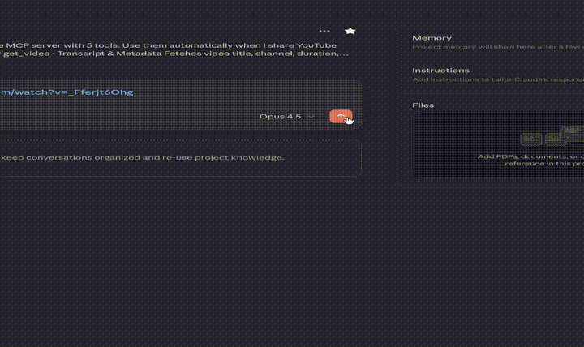

# YouTube Ultimate Toolkit MCP

[](https://opensource.org/licenses/MIT)
[](https://nodejs.org/)
[](https://github.com/Comzee/Youtube-Ultimate-Toolkit-MCP/stargazers)
[](https://github.com/Comzee/Youtube-Ultimate-Toolkit-MCP/commits/master)
[](https://modelcontextprotocol.io/)

A powerful Model Context Protocol (MCP) server that gives Claude AI full access to YouTube content - transcripts, metadata, comments, screenshots, and audio clips.

**Works with both Claude Desktop (local) and Claude Web UI (remote with OAuth).**

## Demo



[Watch full demo video (MP4)](assets/demo.mp4)

## Why This MCP?

| Feature | This MCP | Most Others |
|---------|:--------:|:-----------:|
| Transcripts | ✅ | ✅ |
| Timestamps | ✅ | Some |
| Time range filtering | ✅ | Rare |
| Transcript search | ✅ | Rare |
| Key segments (hook/outro) | ✅ | ❌ |
| Metadata | ✅ | ✅ |
| Playlists | ✅ | Some |
| Comments | ✅ | Very rare |
| Screenshots | ✅ | 1-2 others |
| Audio clips | ✅ | ❌ |
| All URL formats | ✅ | Partial |
| OAuth 2.1 + PKCE | ✅ | ❌ |
| Password protection | ✅ | ❌ |
| Rate limiting | ✅ | ❌ |
| Claude Web UI support | ✅ | Few |

## Features

| Tool | Description |
|------|-------------|
| `get_video` | Fetch video metadata and transcript with search, timestamps, and time ranges |
| `get_playlist` | List all videos in a playlist |
| `get_comments` | Get top comments with likes and reply counts |
| `get_screenshot` | Capture video frames at any timestamp |
| `get_audio` | Extract audio clips (max 120s) for speech/music analysis |

## Quick Start

### Option 1: Local Mode (Claude Desktop)

```bash
# Install
git clone https://github.com/Comzee/Youtube-Ultimate-Toolkit-MCP.git
cd Youtube-Ultimate-Toolkit-MCP
npm install
npm run build

# Run
node dist/index.js
```

Add to Claude Desktop config (`~/.config/claude/claude_desktop_config.json` on Linux, `~/Library/Application Support/Claude/claude_desktop_config.json` on macOS):

```json
{
  "mcpServers": {
    "youtube": {
      "command": "node",
      "args": ["/path/to/Youtube-Ultimate-Toolkit-MCP/dist/index.js"]
    }
  }
}
```

### Option 2: Remote Mode (Claude Web UI)

Remote mode requires OAuth setup and a public URL. See [Remote Mode Setup](#remote-mode-setup) below.

## Prerequisites

- **Node.js 18+**
- **yt-dlp** - YouTube content fetcher (must be kept updated)
- **ffmpeg** - For screenshots and audio extraction (optional)
- **YouTube API Key** - For comments feature only (optional)

### Installing Prerequisites

**Ubuntu/Debian:**
```bash
# Node.js 18+
curl -fsSL https://deb.nodesource.com/setup_18.x | sudo -E bash -
sudo apt install -y nodejs

# yt-dlp (keep updated - YouTube breaks old versions frequently)
pip3 install --upgrade yt-dlp

# ffmpeg (for screenshots and audio)
sudo apt install ffmpeg
```

**macOS:**
```bash
brew install node yt-dlp ffmpeg
```

**Windows:**
```bash
# Install Node.js from https://nodejs.org
# Install yt-dlp: pip install yt-dlp
# Install ffmpeg from https://ffmpeg.org/download.html
```

### Keeping yt-dlp Updated

YouTube frequently changes their API. If transcripts stop working, update yt-dlp:

```bash
pip3 install --upgrade yt-dlp
# or on systems that complain about externally-managed packages:
pip3 install --upgrade --break-system-packages yt-dlp
```

## Installation

```bash
git clone https://github.com/Comzee/Youtube-Ultimate-Toolkit-MCP.git
cd Youtube-Ultimate-Toolkit-MCP
npm install
npm run build
```

## Remote Mode Setup

Remote mode allows you to use this MCP with Claude Web UI (claude.ai) by exposing it over HTTPS with OAuth authentication.

### 1. Configure Environment

```bash
cp .env.example .env
```

Edit `.env`:

```bash
# OAuth credentials
OAUTH_CLIENT_ID=youtube-mcp-client
OAUTH_CLIENT_SECRET=your-secret-here  # Generate: openssl rand -hex 32

# Password for the consent page (bcrypt hash)
# Generate: node -e "require('bcrypt').hash('your-password', 12).then(console.log)"
AUTH_PASSWORD_HASH=$2b$12$...your-hash-here...

# Optional: YouTube API key for get_comments tool
YOUTUBE_API_KEY=your-api-key-here
```

### 2. Start the Server

```bash
# Development
npm run start:remote

# Production (with systemd)
sudo cp youtube-mcp.service /etc/systemd/system/
# Edit the service file to set your username and paths
sudo nano /etc/systemd/system/youtube-mcp.service
sudo systemctl daemon-reload
sudo systemctl enable youtube-mcp
sudo systemctl start youtube-mcp
```

### 3. Set Up HTTPS (Required)

Claude Web UI requires HTTPS. Use nginx as a reverse proxy:

```nginx
server {
    listen 443 ssl;
    server_name your-domain.com;

    ssl_certificate /path/to/fullchain.pem;
    ssl_certificate_key /path/to/privkey.pem;

    location / {
        proxy_pass http://localhost:3010;
        proxy_set_header Host $host;
        proxy_set_header X-Real-IP $remote_addr;
        proxy_set_header X-Forwarded-For $proxy_add_x_forwarded_for;
        proxy_set_header X-Forwarded-Proto $scheme;

        # WebSocket support
        proxy_http_version 1.1;
        proxy_set_header Upgrade $http_upgrade;
        proxy_set_header Connection "upgrade";

        # Important for long-running requests
        proxy_buffering off;
        proxy_cache off;
        proxy_read_timeout 86400s;
        proxy_send_timeout 86400s;
        proxy_set_header X-Accel-Buffering no;
    }
}
```

### 4. Connect Claude Web UI

1. Go to **Settings** → **Connectors** → **Add Custom Connector**
2. Enter URL: `https://your-domain.com/mcp`
3. Start a new chat and enable the MCP
4. Ask Claude to fetch a YouTube video - the authorization popup will appear
5. Enter your password on the consent page and click "Authorize"

## Tools Reference

### get_video

Fetches video metadata and English transcript.

**Parameters:**
| Parameter | Required | Description |
|-----------|----------|-------------|
| `url` | Yes | YouTube URL (any format) or video ID |
| `includeTimestamps` | No | Add `[M:SS]` timestamps to each line |
| `startTime` | No | Start time for transcript range (e.g., "60", "1:00") |
| `endTime` | No | End time for transcript range |
| `searchTerm` | No | Search transcript and highlight matches |
| `keySegmentsOnly` | No | Return only hook (first 40s) and outro (last 30s) |

**Supported URL formats:**
- `youtube.com/watch?v=VIDEO_ID`
- `youtu.be/VIDEO_ID`
- `youtube.com/shorts/VIDEO_ID`
- `youtube.com/live/VIDEO_ID`
- `youtube.com/embed/VIDEO_ID`
- `m.youtube.com/watch?v=VIDEO_ID`
- `music.youtube.com/watch?v=VIDEO_ID`
- Direct video ID: `dQw4w9WgXcQ`

### get_playlist

Lists videos in a YouTube playlist.

**Parameters:**
| Parameter | Required | Description |
|-----------|----------|-------------|
| `url` | Yes | YouTube playlist URL |
| `limit` | No | Max videos to return (default: 50, max: 200) |

### get_comments

Fetches top comments from a video. **Requires `YOUTUBE_API_KEY` in .env.**

**Parameters:**
| Parameter | Required | Description |
|-----------|----------|-------------|
| `url` | Yes | YouTube video URL or ID |
| `maxResults` | No | Number of comments (default: 25, max: 100) |
| `order` | No | Sort: "relevance" (default) or "time" |

### get_screenshot

Captures a frame from a video. **Requires ffmpeg.**

**Parameters:**
| Parameter | Required | Description |
|-----------|----------|-------------|
| `url` | Yes | YouTube video URL |
| `timestamp` | No | Time to capture (default: "0"). Formats: "30", "1:30", "1:30:00" |

**Returns:** Base64-encoded JPEG image

### get_audio

Extracts audio clips for analysis. **Requires ffmpeg.**

**Parameters:**
| Parameter | Required | Description |
|-----------|----------|-------------|
| `url` | Yes | YouTube video URL |
| `startTime` | No | Start time (default: "0") |
| `endTime` | No | End time (optional) |
| `maxDuration` | No | Max seconds (default: 60, max: 120) |

**Returns:** Base64-encoded MP3 audio (128kbps)

## OAuth & Security

The remote mode implements OAuth 2.1 with PKCE for secure authentication.

### How It Works

1. Claude connects to `/mcp` - discovery/handshake methods work without auth
2. When you use a tool, Claude receives a 401 with OAuth discovery info
3. Claude performs dynamic client registration
4. Browser opens the consent page - you enter your password
5. Claude exchanges the auth code for an access token
6. Subsequent requests use the Bearer token

### Security Features

| Feature | Protection |
|---------|------------|
| Password-protected consent | Only you can authorize access |
| Bcrypt password hashing | Password stored securely |
| Rate limiting | 5 attempts per IP, then 10-minute lockout |
| XSS protection | All OAuth parameters HTML-escaped |
| Command injection protection | yt-dlp spawned with `shell: false` |
| PKCE (S256) | Prevents authorization code interception |

## Troubleshooting

### "No English transcript available"
Update yt-dlp - YouTube changes frequently:
```bash
pip3 install --upgrade yt-dlp
```

### MCP won't connect from Claude Web UI
- Ensure HTTPS is configured correctly
- Check service status: `sudo systemctl status youtube-mcp`
- Check logs: `sudo journalctl -u youtube-mcp -f`

### OAuth flow not starting
- Verify `.well-known/` endpoints return 200 (not 401)
- Check browser console for CORS errors
- Ensure `/register` returns valid credentials

### Authorization window doesn't appear
- OAuth triggers on first **tool use**, not on connection
- Start a chat, enable the MCP, then ask Claude to fetch a YouTube video

### Claude using wrong/old tools
Disconnect and reconnect the MCP in Claude settings to refresh the tool list.

## Claude Project Prompt

Use this prompt in a Claude Project to automatically leverage the MCP:

```
You have access to the YouTube MCP server. When I share a YouTube URL:
1. Automatically fetch the transcript with get_video
2. Provide a summary, key takeaways, and notable quotes
3. For long videos (10+ min), consider using keySegmentsOnly=true first

Available tools:
- get_video: Transcript and metadata (supports timestamps, time ranges, search)
- get_playlist: List videos in a playlist
- get_comments: Top comments (requires API key)
- get_screenshot: Capture frames at any timestamp
- get_audio: Extract audio clips for analysis (max 120s)
```

## Architecture

- **Transport:** Streamable HTTP (MCP spec 2025-03-26)
- **Sessions:** Stateful with UUID identifiers (in-memory)
- **OAuth:** Authorization Code + PKCE, Dynamic Client Registration
- **Tokens:** In-memory storage (lost on restart)

## License

MIT - See [LICENSE](LICENSE) for details.

## Contributing

Contributions are welcome! Please open an issue or PR on GitHub.
